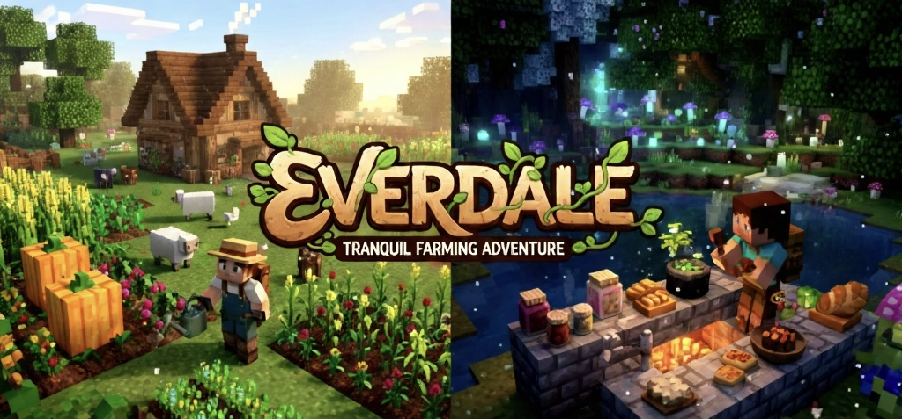

# :herb: Everdale

    

***A peaceful farming and life-simulation mod for Minecraft***

## Table of Contents
- [Overview](#overview)
- [Core Features](#core-features)
  - [Crops & Gardening](#crops--gardening)
  - [Animals & Livestock](#animals--livestock)
  - [Cooking & Kitchen Life](#cooking--kitchen-life)
  - [NPCs & Trade](#npcs--trade)
  - [Exploration & Discovery](#exploration--discovery)
  - [Gentle Realism](#gentle-realism)
- [Design Philosophy](#design-philosophy)
- [Compatibility](#compatibility)
- [Installation](#installation)
- [Configuration](#configuration)
- [License](#license)
- [Contributing](#contributing)
- [Final Note](#final-note)

## :seedling: Overview
**License Notice:**  
Everdale is source-available. The source code is publicly visible for learning and personal use, but redistribution of modified versions is not permitted. See [LICENSE.md](./LICENSE.md) for full details.

**Everdale** is a calm, immersive farming and life-simulation mod designed as an **escape** — a place to slow down, nurture plants and animals, discover regional ingredients and recipes, and lose yourself in a thoughtful, unhurried world. Rather than focusing on efficiency or automation-first gameplay, Everdale emphasizes **care, discovery, and tranquility**. Crops grow naturally over time, animals respond to gentle attention, and cooking rewards experimentation and creativity. Everdale is meant to feel complete on its own: a self-contained experience you can return to when you want peace, focus, and a sense of quiet progression.

## :sparkles: Core Features

### :ear_of_rice: Crops & Gardening
+ Multi-stage, visually rich crop growth
+ Soil quality, water, biome, and environment influence plant development
+ Overhauled vanilla crops for a cohesive, immersive experience
+ New crops, fruits, and wild plants discovered through exploration

### :cow2: Animals & Livestock
+ Gentle animal care — feeding, breeding, and companionship
+ Natural animal behaviors and meaningful feedback
+ Animal products integrated with cooking and crafting systems

### :curry: Cooking & Kitchen Life
+ Flexible, ingredient-driven recipe system
+ Encourages experimentation rather than rigid recipes
+ Kitchen tools and stations (stoves, preparation blocks, containers, etc.)
+ Meals focus on variety, culture, and enjoyment rather than min-maxing

### :farmer: NPCs & Trade
+ Traders and villagers offer regional crops, ingredients, and recipes
+ Cultural identity reflected through food and agriculture
+ Progression through relationships and discovery rather than grinding

### :world_map: Exploration & Discovery
+ Biome- and region-specific plants and ingredients
+ Rare seeds, forgotten recipes, and hidden locations to uncover
+ Environmental storytelling through ruins, farms, and landscapes

### :balance_scale: Gentle Realism
+ Crops require care but remain forgiving
+ Animals thrive with attention; neglect has gentle downsides
+ Weather and environment subtly influence growth and behavior
+ Realism deepens immersion without adding stress

## :herb: Design Philosophy
+ **Immersion first** — every system feels part of the same living world
+ **Peaceful gameplay** — no harsh penalties or artificial pressure
+ **Self-contained** — Everdale is a complete farming experience
+ **Discovery-driven** — curiosity is consistently rewarded
+ **Coexistence, not dependency** — compatible with quality-of-life mods but never reliant on them

Everdale is not designed to "complete" other farming mods; it is meant to **be the star**.

## :electric_plug: Compatibility
+ Fully compatible with:
  + JEI / recipe viewers
  + World-generation mods (e.g. Biomes O'Plenty)
  + Visual and quality-of-life mods
+ Other farming mods may coexist, but Everdale does **not** integrate or depend on them mechanically.

## :package: Installation
1. Install Minecraft 1.20.1 and a supported mod loader (Forge X.Y)
2. Place the Everdale.jar file into your mods folder
3. (Optional) Install JEI for recipe browsing
4. Launch Minecraft and begin your life in **Everdale**

## :low_brightness: Configuration
Everdale includes configuration options for:
+ Vanilla crop replacement (immersive vs compatibility mode)
+ Optional realism systems (soil, water, and animal care)

All options are configurable via the mod's configuration files.

## :scroll: License
Everdale is **source-available** under a custom license.
+ ✅ Source code is publicly visible for learning and personal use
+ ✅ Private modification and sharing between friends is allowed
+ ✅ Modpack use is allowed (unmodified)
+ ❌ Public redistribution of modified versions is not permitted

#### Additional Permissions
If you wish to:
+ Create a public fork
+ Redistribute a modified version
+ Use Everdale assets in another project

You must obtain **explicit written permission** from the author. See [LICENSE.md](./LICENSE.md) for full details.

## :handshake: Contributing
Everdale is a vision-driven project. Bug reports, feedback, and thoughtful suggestions are welcome via GitHub Issues. Code or asset contributions are welcome via pull requests.

Please note that contributions are subject to the project's license and design philosophy.

## :pencil: Final Note
Everdale is meant to be a retreat — a world where growth is slow, curiosity is rewarded, and peace is always within reach.

Take your time.  
Care for the land.  
Let the valley grow with you.
